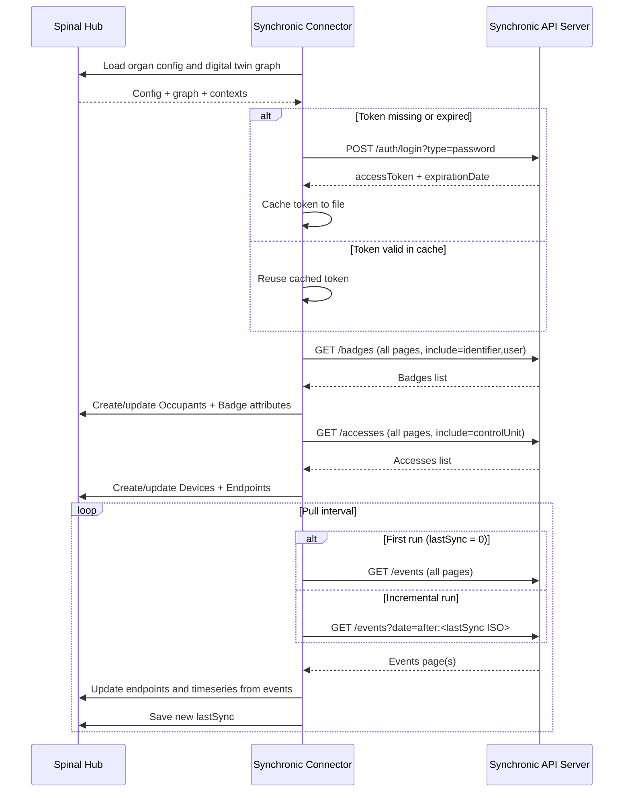

# spinal-organ-connector-synchronic
Simple BOS-SYNCHRONiC api connector
This connector should fetch: 

- List of pass readers.
- Logs of readers -> incremented on endpoints
- List of user IDs.

## Getting Started

These instructions will guide you on how to install and make use of the connector.

### Prerequisites

This module requires a `.env` file in the root directory. Use the `.env.example` file as a template to create your own `.env` file with the necessary configuration.

spinalcom-utils required


### Installation

Clone this repository in the directory of your choice. Navigate to the cloned directory and install the dependencies using the following command:
    
```bash
spinalcom-utils i
```

To build the module, run:

```bash
npm run build
```

### Usage

Start the module with:

```bash
npm run start
```

Or using [pm2](https://pm2.keymetrics.io/docs/usage/quick-start/)
```bash
pm2 start index.js --name organ-connector-xxxxx
```


## Architecture



